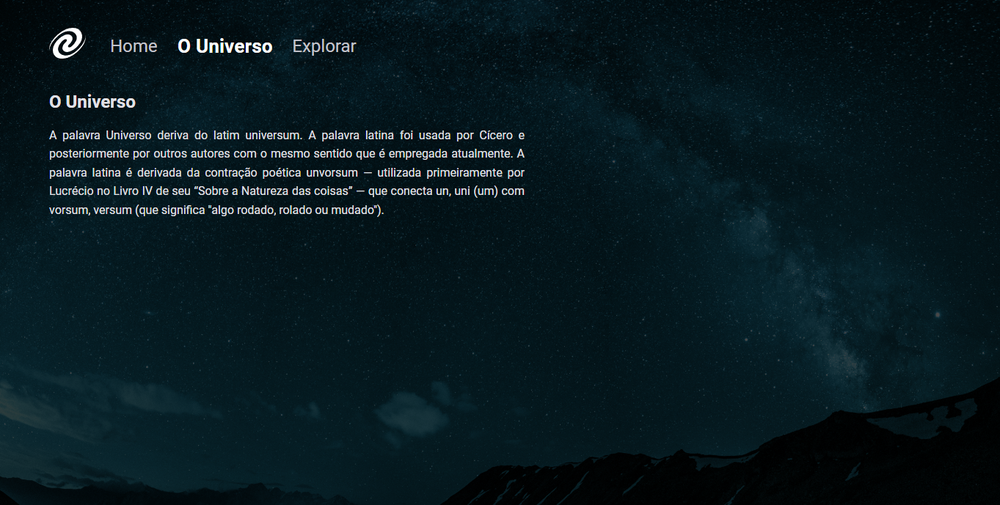

# SPA Universe

# Sobre o projeto / About the project

Neste projeto foi criado uma página para aplicar os conceitos de SPA aprendidos durante este módulo.

In this project, a page was created to apply the SPA concepts learned during this module.

## Layout

# Tecnologias utilizadas / Tech stack
- HTML
- CSS
- Javascript
- Figma

## Autor

